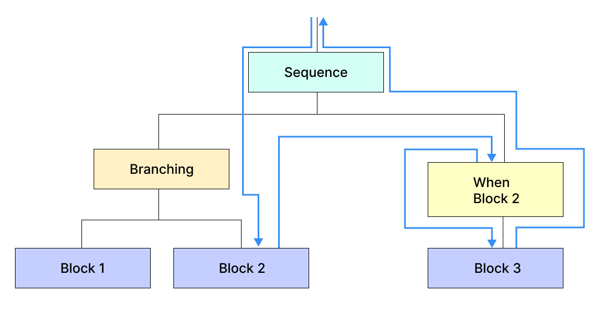
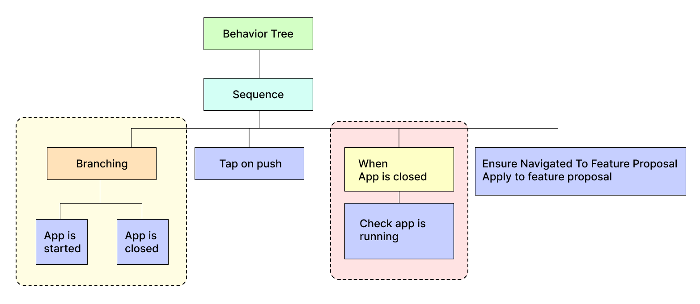
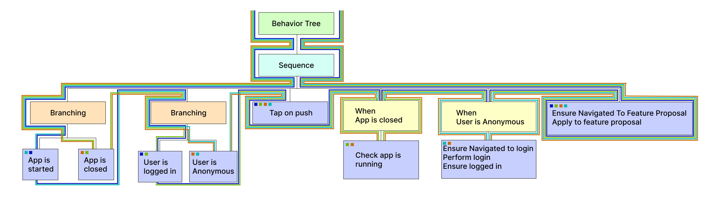

# Streight into the example

Problem: Need to cover new functionality with integration tests.

## Requirements

Environment: 
- Mobile application
- Some UI test framework.

Description:
- User receives promo push notification about new feature, that can be enabled in the app.

Acceptance criteria:
- Tapping on push notification should navigate to feature proposal.
- Once user applies to it, new tab becomes available for the user.
- Once user rejected it, new feature icon appears in settings.

Technical notes:
- Application can be killed or running.
- Anonymous user can also receive push notifications.

### MVP testsing

```cs
[Test]
public void TapOnNotification_ApplyToFeature()
{
    var c = new Context();
    c.TapOnNotification();
    c.EnsureAppIsRunning();
    c.EnsureNavigatedToFeatureProposal();
    c.Item.FeatureProposal.Apply();
    c.Item.Feature.IsEnabled.ClaimTrue();
}
```

Notification appears, system taps on notification, ensures app started and navigated to feature proposal, then user applies to feature and system ensures that feature is enabled.

This test is straitforward, it is just happy path, which not take into account any technical pitfalls.

### More cases with some technical details

First of all app can be already running when notification appears.
It splits existing test into two new tests.

```cs
[Test]
public void TapOnNotification_AppIsClosed_ApplyToFeature()
{
    var c = new Context();

    c.EnsureAppIsNotRunning();
    c.TapOnNotification();
    c.EnsureAppIsRunning();

    c.EnsureNavigatedToFeatureProposal();
    c.Item.FeatureProposal.Apply();
    c.Item.Feature.IsEnabled.ClaimTrue();
}

[Test]
public void TapOnNotification_AppIsRunning_ApplyToFeature()
{
    var c = new Context();

    c.EnsureAppIsRunning();

    c.TapOnNotification();
    c.EnsureNavigatedToFeatureProposal();
    c.Item.FeatureProposal.Apply();
    c.Item.Feature.IsEnabled.ClaimTrue();
}
```

Let's stop and analyze what was written.

As you may notice, almost 80% of entire test bodies are duplicated. It is unavoidable when creating integration tests. The only method how to avoid duplication is to wrap those common lines into methods or classes, and it immediately ruins all the visibility around what is going on in tests.

Next pitfall: user can be logged out for some reason, when notification is tapped.
I would not provide full code, just names of tests, but test bodies contains unavoidable duplications.

```cs
TapOnNotification_AppIsClosed_LoggedIn_ApplyToFeature
TapOnNotification_AppIsRunning_LoggedIn_ApplyToFeature
TapOnNotification_AppIsClosed_NotLoggedIn_ApplyToFeature
TapOnNotification_AppIsRunning_NotLoggedIn_ApplyToFeature
```

As you may see, new requirement causes tests to be doubled. Now the amount of tests are 4 and they are just permutations of preparation steps.

### Maintanance killer

And after all our struggle we realize, that we also need to check failed scenario:
Once user rejects it, new notification icon appeared in the settings.

All our tests are going to double once again, 8 in total.

```cs
TapOnNotification_AppIsClosed_LoggedIn_ApplyToFeature
TapOnNotification_AppIsRunning_LoggedIn_ApplyToFeature
TapOnNotification_AppIsClosed_NotLoggedIn_ApplyToFeature
TapOnNotification_AppIsRunning_NotLoggedIn_ApplyToFeature

TapOnNotification_AppIsClosed_LoggedIn_RejectFeature
TapOnNotification_AppIsRunning_LoggedIn_RejectFeature
TapOnNotification_AppIsClosed_NotLoggedIn_RejectFeature
TapOnNotification_AppIsRunning_NotLoggedIn_RejectFeature
```

| App is running   | User is logged in | Intend to apply |
| :----- | :------: | ----: |
| False | False | False |
| False | False | True |
| False | True | False |
| False | True | True |
| True | False | False |
| True | False | True |
| True | True | False |
| True | True | True |

### Let's do some math

Formally we have superset of three different unions and mathematecally speaking amount of cases are:
P(AppState) x P(UserState) x P(UserIntent) = 2 x 2 x 2 = 8;
This could be even worse. Currently in this example we assumed that: AppState = { running, closed }, but in reality AppState = { running, closed, in background }.
It means that the amount of different cases should be 3 x 2 x 2 = 12;
To make things even worse let's assume that now we have additional requirement:
"Navigation is ignored if user's role is manager".
Considering all mentioned above:
P(AppState) x P(UserState) x P(UserRole) x P(UserIntent) = 3 x 2 x 2 x 2 = 24;
Actually some of those steps are duplicated, especially for manager's role, but with this amount of similar cases it is obvious, that something is wrong with testing.
Assuming that we spend some significant amount of time to cover all this scenarios, every change in requirements is going to cause full review process even for scenarios, that were not affected by the requirements directly.

New approach is needed.

# Behavior Tree approach

## Unit tests versus integrational tests

1. Unit tests have Arrange-Act-Assert pattern that makes tests streitforward.
2. In the meantime integration and e2e tests usually consist of chains of AAAs, often intersecting chains.
3. When we are trying to write integration tests it is common for us to duplicate a lot of flows, like: process cart when user is anonymous, when user is logged in, in foreground, in background, in several different tabs and so on, so a lot of common parts are going to be duplicated. As a result maintanance and visibility of coverage decreasing a lot.
4. In this case it is tempting to split integration test into independent parts of AAA blocks and chain them somehow, defining dependencies.
5. But we cannot, we don't have the right tool.
6. Or we do?..

## Formal definition

A behavior tree is a mathematical model of plan execution used in computer science, robotics, control systems and video games.

First of all it is a model of plan execution.
In our case we can think of BT as a way to systemize testing requirements and scenarios.
Quick overview can be found here:
https://github.com/Stanislau/behavior-tree-for-testing

Behavior Tree (BT) is a way to organize flows in a form of tree, very similar to flow diagram, but with a bit different notation. More information is here:
https://en.wikipedia.org/wiki/Behavior_tree
https://staff.itee.uq.edu.au/kirsten/publications/BTMergeSemantics_withCopyright.pdf

Seems like it is just what we need.

## Key concepts

### Step

Step - block of code to be executed.
It can be any block of code, but for us it is usually one of AAA pattern part that can be written just once and then integrated into the structure.
To not overcomplicate things Step - it is just some useful code versus other parts of BT components.

### Sequence
 
Sequence - node-controller, executes all children in sequencial order.
Children of BT could be steps or any other types of BT elements, even other BTs.


### Branching

Branching - each new run this node execute new child from the list of children.


### When

When - conditional executing node, executed it's child only when required node is included into execution flow.




## Same example, different approach

Below I show how to solve mentioned exponential tests growth with Behavior Tree.

### MVP


```cs
new BehaviorTree(
	new Step(
		"Tapping on push notification should navigate to feature proposal. " +
		"Once user applies to it, new tab become available for the user.",
		async c =>
		{
			// preparation part
			c.TapOnNotification();
			c.EnsureAppIsRunning();
			// functionality check part
			c.EnsureNavigatedToFeatureProposal();
			c.Item.FeatureProposal.Apply();
			c.Item.Feature.IsEnabled.ClaimTrue();
		}
	)
)
```

Same as step 1 standalone unit test, so we can start with simple test without any tree in mind.
It provides smooth learning curve and intuitive tree decomposition. You do not need to think about decomposition in advance, you can start writing your tests right away.

### Application state

We can (as an intermediate step) rewrite our tree a bit to decompose to the sequence of different steps.


And then provide additional starting point with new check.



Note that there is only one source of two flows, so no code duplication here so far. Here is code sample how it might look if we code this.

```cs
new BehaviorTree(
	new Sequence(
		new Branching(
			new Step("App is started", c => c.EnsureAppIsRunning()).As(out var appIsStarted),

			new Step("App is closed", c => c.EnsureAppIsNotRunning()).As(out var appIsClosed),
		),

		new Step("Tap on push notification", c => c.TapOnNotification()),

		new When(appIsClosed,
			new Step("Ensure app is running now", c => c.EnsureAppIsRunning())
		),

		new Step(
			"Tapping on push notification should navigate to feature proposal. " +
			"Once user applies to it, new tab become available for the user.",
			c =>
			{
				c.EnsureNavigatedToFeatureProposal();
				c.Item.FeatureProposal.Apply();
				c.Item.Feature.IsEnabled.ClaimTrue();
			}
		)
	)
)
```

In classic approach it looked like:

```cs
[Test]
public void TapOnNotification_AppIsClosed_ApplyToFeature()
{
    var c = new Context();

    c.EnsureAppIsNotRunning();
    c.TapOnNotification();
    c.EnsureAppIsRunning();

    c.EnsureNavigatedToFeatureProposal();
    c.Item.FeatureProposal.Apply();
    c.Item.Feature.IsEnabled.ClaimTrue();
}

[Test]
public void TapOnNotification_AppIsRunning_ApplyToFeature()
{
    var c = new Context();

    c.EnsureAppIsRunning();

    c.TapOnNotification();
    c.EnsureNavigatedToFeatureProposal();
    c.Item.FeatureProposal.Apply();
    c.Item.Feature.IsEnabled.ClaimTrue();
}
```

As we can see, here we already reusing some part of a code, approximately 40% of it.

### User state

Further adjustments. Do not need to think about already defined parts. If functionality is extending, we need to extend the tree.


```cs
new BehaviorTree(
	new Sequence(

		new Branching(
			new Step("App is started", c => c.EnsureAppIsRunning()).As(out var appIsStarted),

			new Step("App is closed", c => c.EnsureAppIsNotRunning()).As(out var appIsClosed),
		),

		// new code block (yellow)
		new Branching(
			new Step("User is logged in", c => c.PrepareLoggedInContext()).As(out var userIsLoggedIn),

			new Step("User is not logged in", c => c.EnsureAppIsNotRunning()).As(out var userIsNotLoggedIn)
		),

		new Step("Tap on push notification", c => c.TapOnNotification()),

		new When(appIsClosed,
			new Step("Ensure app is running now", c => c.EnsureAppIsRunning())
		),

		// also new code block (orange)
		new When(userIsNotLoggedIn,
			new Step("Log in and continue the flow",
				async c =>
				{
					c.EnsureNavigatedToLogin();
					c.PerformLogIn();
					c.EnsureUserIsLoggedIn();
				})
		),

		new Step(
			"Tapping on push notification should navigate to feature proposal. " +
			"Once user applies to it, new tab become available for the user.",
			c =>
			{
				c.EnsureNavigatedToFeatureProposal();
				c.Item.FeatureProposal.Apply();
				c.Item.Feature.IsEnabled.ClaimTrue();
			}
		)
	)
)
```

No code duplication, full visibility, ability to debug each step.
If you traverse this tree using behavior tree rules you'd already come up with 4 scenarios.



N1 (blue)
- User is logged in
- App is started
- Tap on push notification
- Tapping on push notification should navigate to feature proposal. Once user applies to it, new tab become available for the user.

N2 (green)
- User is logged in
- App is closed
- Tap on push notification
- Ensure app is running now
- Tapping on push notification should navigate to feature proposal. Once user applies to it, new tab become available for the user.

N3 (aqua)
- User is not logged in
- App is started
- Tap on push notification
- Log in and continue the flow
- Tapping on push notification should navigate to feature proposal. Once user applies to it, new tab become available for the user.

N4 (orange)
- User is not logged in
- App is closed
- Tap on push notification
- Ensure app is running now
- Log in and continue the flow
- Tapping on push notification should navigate to feature proposal. Once user applies to it, new tab become available for the user.

### Negative case handling

Finally, to add the last requirements, we just need to decompose the last step:


```cs
new Step(
	"Tapping on push notification should navigate to feature proposal. " +
	"Once user applies to it, new tab become available for the user.",
	async c =>
	{
		c.EnsureNavigatedToFeatureProposal();
		c.Item.FeatureProposal.Apply();
		c.Item.Feature.IsEnabled.ClaimTrue();
	}
)
```


We move navigation check into common step and branching the rest.


```cs
new Step(
    "Tapping on push notification should navigate to feature proposal.", c => c.EnsureNavigatedToFeatureProposal()),

new Branching(
    new Step("Once user applies to it, new tab become available for the user.",
        async c =>
        {
            c.Item.FeatureProposal.Apply();
            c.Item.Feature.IsEnabled.ClaimTrue();
        }
    ),

    new Step("Once user rejects it, new notification icon appeared in the settings.",
        async c =>
        {
            c.Item.FeatureProposal.Reject();
            c.Item.Feature.IsEnabled.ClaimFalse();

            c.Item.Feature.IconVisible.ClaimTrue();
        }
    )
)
```

That's it. Adding two more steps added 4 more scenarios.
Imagine that adding each new requirement will generate even more scenarios without expanding codebase.

## What's next

To make long story short:
- Add tools to support BTT approach.
- Visualize three, created from code.
- Apply same approach to requirements definition.
- Make all teammembers talk the same language.